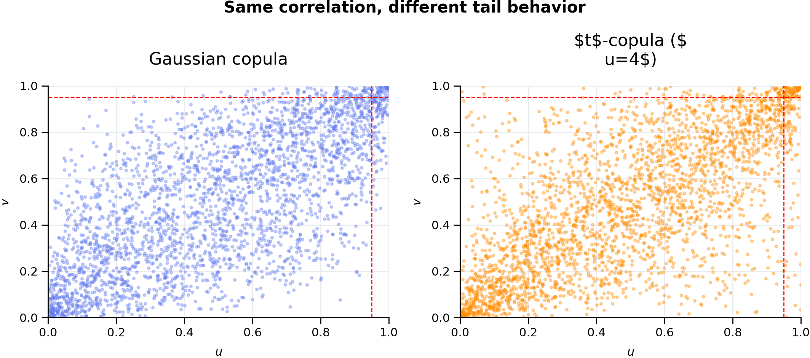
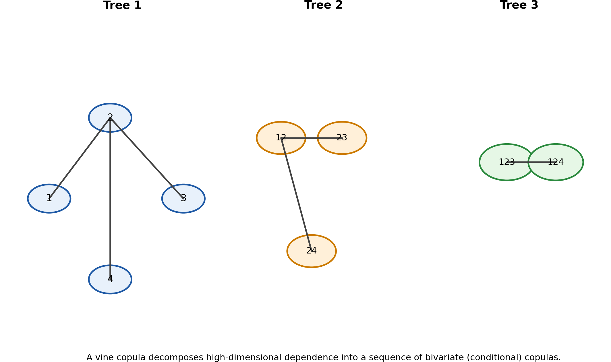
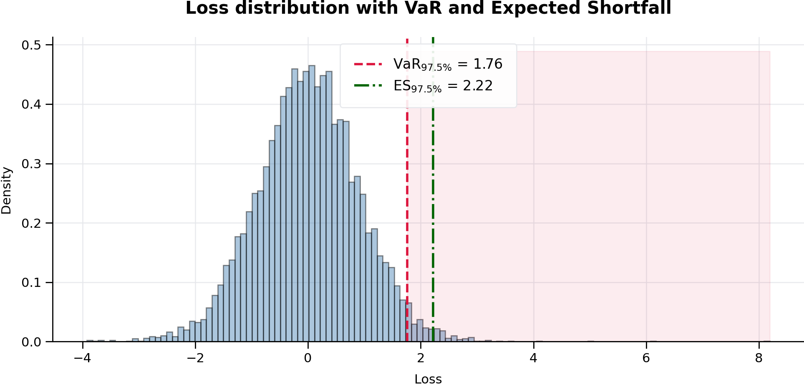

<style>
@page { size: A4; margin: 18mm 16mm 18mm 16mm; }
body { font-family: Georgia, "Times New Roman", serif; line-height: 1.35; orphans: 3; widows: 3; }
h1, h2, h3, h4 { page-break-after: avoid; }
pre, code, blockquote, table, img { page-break-inside: avoid; }
img.chapter-figure { display:block; margin:6mm auto; max-width:170mm; width:100%; height:auto; }
</style>

# Beyond the Formulas: Empirical MLE, FFT, Laplace Transforms, Copula Dependence, Quadrature, Autodiff, and Tail-Risk Workflows

##### by Gene Boo

This paper develops a unified computational framework for estimating, analyzing, and stress-testing distributions of sums of random variables when classical closed-form methods fail, with a particular focus on risk aggregation, dependent structures, and numerical inference. The core contribution is to show how **independent sums** can be handled efficiently through **Empirical Maximum Likelihood Estimation (MLE)** on a numerical grid accelerated by the **Fast Fourier Transform (FFT)**, while **dependent sums** require a principled shift toward **quadrature-based integration**, copula methods, and conditional-factor constructions rather than naive marginal FFT multiplication. The paper further extends this probability engine to include **Laplace-transform formulations** for positive-support variables, **automatic differentiation** for gradient-based calibration and sensitivity analysis, **$t$-copulas** for tail dependence, **vine copulas** for flexible high-dimensional dependence, and integrated **Value-at-Risk (VaR)** and **Expected Shortfall (ES)** workflows as natural outputs of the same fitted distributional system. Taken together, the paper presents a practical, research-grade roadmap for moving from symbolic probability to **computational probability engineering** in finance, insurance, and related quantitative risk applications.

## Table of Contents

- [Abstract](#abstract)
- [Reader's Guide](#readers-guide)
- [1. The Problem: When the Real World Refuses to Behave](#1-the-problem-when-the-real-world-refuses-to-behave)
- [2. The Secret Weapon: FFT and the Characteristic-Function View](#2-the-secret-weapon-fft-and-the-characteristic-function-view)
- [3. The Laplace Transform Link: Same Song, Different Door](#3-the-laplace-transform-link-same-song-different-door)
- [4. Empirical MLE on a Grid](#4-empirical-mle-on-a-grid)
- [5. Engineering Guardrails: The Places Numerical Methods Usually Fail](#5-engineering-guardrails-the-places-numerical-methods-usually-fail)
- [6. Core Mathematics, Cleaned and Fact-Checked](#6-core-mathematics-cleaned-and-fact-checked)
- [7. Copulae: A Practical Way to Handle Correlated, Differently Distributed Assets](#7-copulae-a-practical-way-to-handle-correlated-differently-distributed-assets)
- [8. Dependency Kills the Naive FFT Shortcut — So What Replaces It?](#8-dependency-kills-the-naive-fft-shortcut--so-what-replaces-it)
- [9. Quadrature for Dependent Sums: Which Rule for Which Problem?](#9-quadrature-for-dependent-sums-which-rule-for-which-problem)
- [10. Production-Grade Python: Core Utilities](#10-production-grade-python-core-utilities)
- [11. Production-Grade Python: Dependent Sums with Copula + Quadrature](#11-production-grade-python-dependent-sums-with-copula--quadrature)
- [12. Hybrid Method: Factor Dependence, FFT Inside, Quadrature Outside](#12-hybrid-method-factor-dependence-fft-inside-quadrature-outside)
- [13. Beyond Two Assets: Cubature and Sparse Grids](#13-beyond-two-assets-cubature-and-sparse-grids)
- [14. Notebook-Style Worked Examples and Stress Tests](#14-notebook-style-worked-examples-and-stress-tests)
- [15. Real-World Examples That Make the Methods Click](#15-real-world-examples-that-make-the-methods-click)
- [16. Decision Framework: Which Tool Should You Use?](#16-decision-framework-which-tool-should-you-use)
- [17. Key Insights in Plain English](#17-key-insights-in-plain-english)
- [18. Conclusion](#18-conclusion)
- [19. Visual Guide and Figure Roadmap](#19-visual-guide-and-figure-roadmap)
- [20. Automatic Differentiation Through FFT and Quadrature Pipelines](#20-automatic-differentiation-through-fft-and-quadrature-pipelines)
- [21. $t$-Copulas: Why Correlation Alone Is Not Enough](#21-t-copulas-why-correlation-alone-is-not-enough)
- [22. Vine Copulas: Flexible Multivariate Dependence Beyond Elliptical Families](#22-vine-copulas-flexible-multivariate-dependence-beyond-elliptical-families)
- [23. VaR and Expected Shortfall: Tail-Risk Workflows That Sit on Top of the Sum Distribution](#23-var-and-expected-shortfall-tail-risk-workflows-that-sit-on-top-of-the-sum-distribution)
- [24. Suggested Extensions for the Next Draft](#24-suggested-extensions-for-the-next-draft)
- [25. Complete Bibliography](#25-complete-bibliography)

## Abstract
This chapter explains how to estimate the distribution of a sum of random variables when classical closed-form probability theory breaks down. The central tool in the independent case is **Empirical Maximum Likelihood Estimation (MLE)** built on a numerical grid and accelerated by the **Fast Fourier Transform (FFT)**. We then extend the framework in three directions that matter in the wild:

1. the relationship between Fourier methods and the **Laplace transform** for non-negative variables,
2. the treatment of **correlated, differently distributed assets** via **copulae**,
3. and the use of **quadrature** as the main deterministic engine when dependence breaks the simple FFT product rule.

The chapter is written in a narrative, plain-English tone, but the mathematics and code are tightened for research use. Common informal mistakes—such as confusing **linear** and **circular** convolution, overclaiming what zero-padding can fix, assuming FFT still works on marginal densities under dependence, or using KDE without acknowledging oversmoothing—are corrected explicitly and sourced. The result is a complete, reproducible guide to computational probability engineering for summed risks. [1–19]

---

## Reader's Guide
If you want the short version first, here it is.

- If the component random variables are **independent**, then the density of their sum is a **convolution**, and convolution becomes multiplication in the Fourier domain. That is why FFT is the computational hammer. [1,2,4,5,19]
- If the variables are **non-negative**, the same multiplication logic appears in the **Laplace-transform** world. In fact, the transform identities for sums are easiest to read in Laplace form when support is $[0,\infty)$. [3,6]
- If the variables are **dependent**, you cannot simply multiply marginal characteristic functions anymore. The right object is the **joint** law, equivalently the **joint characteristic function** or a **copula plus marginals**. [7,19]
- In low-dimensional dependent problems, **quadrature** is often the best deterministic alternative to Monte Carlo, because the sum-density formula becomes an ordinary integral. Adaptive quadrature, tanh-sinh quadrature, Gauss-Hermite rules, cubature, and sparse grids each have a natural role. [20–28]
- In practice, the best workflow depends on structure:
  - **Independent** sums → FFT,
  - **Dependent bivariate** sums → quadrature,
  - **Factor copula** dependence → FFT inside, quadrature outside,
  - **Moderate dimension** → cubature / sparse grids,
  - **High dimension** → quasi-Monte Carlo or Monte Carlo. [4,5,7,8,20–28]

That is the whole chapter in five bullets. Everything below is the careful version.

---

## 1. The Problem: When the Real World Refuses to Behave

### 1.1 The detective story version

Suppose you are handed data and asked:

> *What hidden probabilistic machine could plausibly have generated this?*

That is the soul of **maximum likelihood estimation**. You posit a model with parameters $\theta$, write the likelihood $L(\theta \mid \text{data})$, and choose the parameter values that make the observed data most likely.

For textbook models, life is nice. If you observe $7$ heads in $10$ coin flips, the likelihood for the Bernoulli success parameter $p$ is

$$
L(p \mid \text{data}) = p^7(1-p)^3,
$$

and the maximizer is $\hat p = 0.7$.

Clean. Elegant. Honest.

Now meet the real world.

### 1.2 The villain: ugly distributions and hidden sums

In real applications, the observed quantity is often a **sum** of several hidden pieces:

- a **portfolio return** is the weighted sum of asset returns,
- a **detector energy reading** is the sum of many latent contributions,
- an **insurance loss** is the aggregate of heterogeneous claims,
- a **network response time** can be the sum of processing, queueing, routing, and retry delays,
- a **supply-chain delay** can be the sum of customs, logistics, warehousing, and transport shocks.

If the components were all Gaussian, we would be done in one line. But they usually are not. Financial returns are often heavy-tailed and asymmetric; insurance severities often live on $[0,\infty)$ and can be extreme; engineering lifetimes often look more like Weibull or mixtures than anything neat. [9–16]

So the exact distribution of the sum is usually **not** something you can differentiate by hand.

### 1.3 Why convolution is the bottleneck

If $X$ and $Y$ are independent continuous random variables with densities $f_X$ and $f_Y$, then the density of $S = X+Y$ is the convolution

$$
f_S(s) = (f_X * f_Y)(s) = \int_{-\infty}^{\infty} f_X(x)f_Y(s-x)\,dx.
$$

That fact is standard probability theory. [1]

The trouble is not the identity—it is the **cost**. If you are fitting parameters by MLE, you must evaluate that sum-density many times across parameter space. If you do the integral directly every time, the optimization becomes painfully slow.

That is where FFT enters.

---

## 2. The Secret Weapon: FFT and the Characteristic-Function View

### 2.1 The DJ analogy

In the original domain, convolution is a messy sliding integral. In the Fourier domain, convolution becomes multiplication. This is the core **convolution theorem**. [2,4,5,17]

If a random variable $X$ has density $f_X$, its **characteristic function** is

$$
\phi_X(t)=\mathbb{E}[e^{itX}] = \int_{-\infty}^{\infty} e^{itx}f_X(x)\,dx,
$$

which is the Fourier transform of the density in the probability convention. [2,19]

For **independent** random variables $X$ and $Y$,

$$
\phi_{X+Y}(t) = \phi_X(t)\phi_Y(t).
$$

That one identity is the computational jackpot. [2,19]

Once you have the product, you invert the transform to recover the sum density:

$$
f_{X+Y}(x)=\mathcal{F}^{-1}\big[\phi_X(t)\phi_Y(t)\big](x).
$$

### 2.2 The complexity payoff

A direct discrete convolution on a grid of length $N$ is roughly $O(N^2)$ per pairwise convolution. FFT-based convolution reduces that to roughly $O(N\log N)$. This speedup is why FFT-based methods are standard in signal processing and numerical convolution. [4,5,17]

### 2.3 Integrity correction: linear convolution versus circular convolution

This is one of the most common places where casual write-ups quietly go wrong.

The **discrete Fourier transform** treats finite sequences as periodic. On a finite grid, naive FFT multiplication followed by an inverse FFT gives a **circular** convolution unless you pad appropriately. SciPy explicitly warns about periodicity caveats in the FFT tutorial, and `fftconvolve` distinguishes linear-convolution output modes from raw periodic wrap-around behavior. [4,5]

So, for production work:

- use **zero-padding** or `scipy.signal.fftconvolve(..., mode='full')` to mimic **linear** convolution, [5]
- remember that wrap-around artifacts are caused by periodicity and insufficient support, [4]
- and inspect the boundaries visually or with diagnostics.

That correction matters because sloppy same-length FFT code can silently bias the tails of your fitted distribution.

### 2.4 Layman explanation

Picture two long strips of paper with probability mass printed on them. A direct convolution slides one strip across the other and recomputes overlap at every position. FFT says: **stop sliding the strips in the original world; jump to a transform world where “sliding overlap” becomes just multiplication**. Then transform back.

That is why FFT feels like a hack. It is a legal hack.

---

## 3. The Laplace Transform Link: Same Song, Different Door

### 3.1 Why Laplace appears naturally

For non-negative random variables, another transform is often more natural:

$$
\mathcal{L}_X(s)=\mathbb{E}[e^{-sX}], \qquad s\ge 0,
$$

whenever the expectation exists. This is the **Laplace transform** of the law of $X$. [3,6]

For independent non-negative variables $X$ and $Y$,

$$
\mathcal{L}_{X+Y}(s)
=\mathbb{E}[e^{-s(X+Y)}]
=\mathbb{E}[e^{-sX}]\,\mathbb{E}[e^{-sY}]
=\mathcal{L}_X(s)\mathcal{L}_Y(s).
$$

So the multiplication story survives exactly.

### 3.2 How it connects to characteristic functions

The characteristic function is

$$
\phi_X(t)=\mathbb{E}[e^{itX}],
$$

and the moment generating function is

$$
M_X(u)=\mathbb{E}[e^{uX}],
$$

when it exists. Standard references observe that characteristic functions can be viewed as moment transforms evaluated on the imaginary axis when the relevant extension exists. [2,3,19]

For non-negative variables, the Laplace transform and moment generating function are linked by

$$
\mathcal{L}_X(s)=M_X(-s),
$$

and therefore, when the relevant complex continuation is valid,

$$
\phi_X(t)=\mathcal{L}_X(-it).
$$

This does **not** mean the Laplace transform is always numerically interchangeable with the Fourier transform. It means the two transform views are mathematically connected. In practice:

- use the **Laplace** viewpoint when support is $[0,\infty)$ and positive-support structure matters, [3,6]
- use the **Fourier / characteristic-function** viewpoint when support can be signed or when direct FFT inversion is convenient. [2,4]

### 3.3 Layman explanation

Think of Fourier and Laplace as two related “translation devices.” They both convert a hard operation in the original world into an easier operation in a transformed world. The difference is mainly **what kind of variable they are better suited for**.

---

## 4. Empirical MLE on a Grid

### 4.1 Why “empirical” MLE?

Here, **empirical MLE** means the likelihood is not built from a closed-form sum density. Instead, we build the density **numerically** on a grid and evaluate it by interpolation.

Suppose we observe data $r_1,\dots,r_n$ that we believe come from the sum

$$
S=X_1+X_2+\cdots+X_K,
$$

with component distributions parameterized by $\theta$.

We aim to maximize

$$
\ell(\theta)=\sum_{i=1}^n \log f_S(r_i;\theta).
$$

If $f_S$ is unavailable in closed form, we approximate it numerically.

### 4.2 The grid

Choose a uniform grid

$$
x_0, x_1, \dots, x_{N-1},
$$

with spacing

$$
dx = x_{j+1}-x_j.
$$

For each component density $f_k(\cdot;\theta_k)$, evaluate

$$
f_k(x_0;\theta_k),\dots,f_k(x_{N-1};\theta_k).
$$

Then convolve the discretized densities using FFT-based **linear** convolution. Because the continuous convolution integral is approximated by a sum, each discrete convolution contributes a factor of $dx$:

$$
(f*g)(s)\approx\sum_j f(x_j)g(s-x_j)\,dx.
$$

That $dx$ factor is important in code.

### 4.3 Interpolation

Observed data points will almost never land exactly on the grid. So after the sum density is computed, we interpolate. Linear interpolation is the simplest default:

$$
f(r)\approx (1-w)f(x_j)+wf(x_{j+1}),
$$

for $r\in[x_j,x_{j+1}]$ and

$$
w=\frac{r-x_j}{dx}.
$$

### 4.4 The log-likelihood

The numerical log-likelihood is then

$$
\ell(\theta)=\sum_{i=1}^n \log\big(\operatorname{Interp}[f_S(\cdot;\theta)](r_i)\big).
$$

The negative log-likelihood is minimized numerically.

### 4.5 Why this approach matters

This frees you from the tiny set of distributions whose sums you can write down neatly. If you can evaluate each marginal density and convolve numerically, you can build a likelihood.

That is the philosophy shift:

> from **symbolic probability** to **computational probability**.

---

## 5. Engineering Guardrails: The Places Numerical Methods Usually Fail

### 5.1 Aliasing and wrap-around

A finite DFT views sequences as periodic. If the grid is too narrow, tail mass wraps around. This produces false probability near the opposite boundary. SciPy’s FFT tutorial explicitly notes periodicity caveats, and `fftconvolve` examples show boundary artifacts from padding choices. [4,5]

**Rule of thumb:** the grid should extend beyond the observed data by a comfortable margin, and much more so for heavy tails.

### 5.2 Zero-padding helps—but it does not create information

Zero-padding is valuable because it helps separate the linear-convolution region from wrap-around contamination and can improve interpolation in the transform domain. But zero-padding does **not** increase the true Nyquist limit. The actual sampling resolution is still determined by $dx$. [4,5]

### 5.3 KDE is not magic

SciPy’s `gaussian_kde` notes that KDE works best for unimodal data and that bimodal or multimodal data may be oversmoothed. Bandwidth selection often matters more than the kernel itself. [13]

So if you use KDE to estimate the distribution of a dependent sum from simulated samples, inspect the result visually and do not treat the default bandwidth as sacred.

### 5.4 The $\log(0)$ cliff

Numerical interpolation or truncation can yield density values that are exactly $0$ at some observed points. Then

$$
\log(0)=-\infty,
$$

and the optimizer falls off a cliff.

Use a small floor such as $\max\{f(r_i),10^{-12}\}$. That is not cheating; it is standard numerical hygiene.

### 5.5 Parametrization gotchas in SciPy

A few library facts matter in production code:

- `scipy.stats.t` uses degrees of freedom `df`, plus optional `loc` and `scale`. [9]
- `scipy.stats.expon` uses `scale = 1/\lambda` if you think in terms of a rate $\lambda$. [10]
- `scipy.stats.weibull_min` uses shape parameter `c` and optional `loc`, `scale`. [11]
- `scipy.stats.genextreme` uses a sign convention for the GEV shape parameter `c` that differs from some texts and software. SciPy says this explicitly. [12]

Ignore these conventions and you can fit the wrong model while thinking your code is fine.

---

## 6. Core Mathematics, Cleaned and Fact-Checked

### 6.1 Independent sums

If $X_1,\dots,X_K$ are independent with densities $f_1,\dots,f_K$, then

$$
f_S = f_1 * f_2 * \cdots * f_K,
$$

and in the Fourier domain,

$$
\phi_S(t)=\prod_{k=1}^K \phi_{X_k}(t).
$$

This is the classical, correct FFT case. [1,2,19]

### 6.2 Dependent sums: what changes

If $X$ and $Y$ are **dependent**, then

$$
f_{X+Y}(s) \neq (f_X*f_Y)(s)
$$

in general.

The correct density identity is

$$
f_S(s)=\int_{-\infty}^{\infty} f_{X,Y}(x,s-x)\,dx,
$$

where $f_{X,Y}$ is the **joint** density. [1]

### 6.3 The right characteristic-function identity under dependence

For dependent variables, the simple product rule disappears, but characteristic functions are still powerful. If $(X,Y)$ has a **joint characteristic function**

$$
\phi_{X,Y}(u,v)=\mathbb{E}[e^{i(uX+vY)}],
$$

then for the sum $S=X+Y$,

$$
\phi_S(t)=\mathbb{E}[e^{it(X+Y)}]=\phi_{X,Y}(t,t).
$$

That identity is the cleanest way to say what survives under dependence: if you know the **joint** characteristic function, you can still invert it numerically. [19]

This is a key integrity correction. The FFT idea does **not** die under dependence; what dies is the shortcut

$$
\phi_S(t)=\phi_X(t)\phi_Y(t),
$$

which requires independence. [2,19]

---

## 7. Copulae: A Practical Way to Handle Correlated, Differently Distributed Assets

### 7.1 Why copulas are the natural language here

Sklar’s theorem says that, under continuity conditions, a multivariate distribution can be decomposed into its marginals and a copula capturing dependence. In the bivariate case,

$$
F_{X,Y}(x,y)=C\big(F_X(x),F_Y(y)\big),
$$

and if the densities exist,

$$
f_{X,Y}(x,y)=c\big(F_X(x),F_Y(y)\big)f_X(x)f_Y(y),
$$

where $c$ is the copula density. [7,8]

This is exactly what you need when assets have:

- different marginal distributions,
- asymmetry,
- heavy tails,
- but meaningful dependence.

### 7.2 The sum density under a copula

For $S=X+Y$, substitute the copula-density factorization into the general sum identity:

$$
f_S(s)=\int_{-\infty}^{\infty}
 c\big(F_X(x),F_Y(s-x)\big)
 f_X(x)
 f_Y(s-x)
\,dx.
$$

That formula is correct. It is also the place where life becomes more interesting.

### 7.3 Layman explanation

Independence says: “the two pieces do their own thing.” Dependence says: “whether one piece is extreme changes how likely the other piece is to be extreme.” A copula is a formal way of writing that relationship **separately from the shapes of the marginals**.

That separation is powerful because in finance, insurance, and engineering, the **shapes** of the marginals and the **pattern** of dependence are usually two different modeling problems.

### 7.4 A crucial identifiability warning

If you observe **only the aggregated sum** and do **not** observe the component series, then jointly identifying:

- several marginal parameter sets, and
- a flexible dependence structure,

is often weak or impossible without additional structure, side information, or strong assumptions. This is a statistical-identifiability issue, not a coding issue. [7,14,16]

---

## 8. Dependency Kills the Naive FFT Shortcut — So What Replaces It?

This is the question that matters.

If dependence is present, you cannot just FFT the marginals and multiply. So what do you do instead?

### 8.1 The short answer

You have four main routes.

1. **Joint characteristic function route**: if you know $\phi_{X,Y}(u,v)$, then compute
   $$
   \phi_S(t)=\phi_{X,Y}(t,t)
   $$
   and invert numerically. Elegant, but rare outside special models. [19]
2. **Direct quadrature route**: evaluate
   $$
   f_S(s)=\int f_{X,Y}(x,s-x)\,dx
   $$
   numerically. This is often the best deterministic tool in low dimensions. [20–24]
3. **Factor-model route**: condition on a latent factor so that variables become conditionally independent, convolve conditionally (possibly by FFT), then integrate over the factor via quadrature. [7,8,26]
4. **Simulation route**: if dimension or complexity is too large, use Monte Carlo or quasi-Monte Carlo and then estimate the sum density or risk metrics. [18,24]

### 8.2 Why quadrature is often *the* deterministic tool

For a dependent **bivariate** sum, the sum density at each fixed $s$ is only a **one-dimensional integral**:

$$
f_S(s)=\int_{-\infty}^{\infty} f_{X,Y}(x,s-x)\,dx.
$$

That is exactly what adaptive quadrature routines such as `quad` are designed for. They support infinite limits, specified tolerances, and even difficult subintervals. [20,21]

This is why in low-dimensional dependent-sum inference, quadrature often becomes the natural replacement for the lost FFT shortcut.

### 8.3 Why quadrature beats plain Monte Carlo in many calibration problems

MLE likes deterministic objective functions. Monte Carlo inside the likelihood produces simulation noise. Quadrature gives a deterministic answer and an error estimate, which typically makes optimization smoother and more stable in low dimensions. [20–24]

Layman translation: if you are climbing a mountain blindfolded, it is much easier if the mountain does not move under your feet.

---

## 9. Quadrature for Dependent Sums: Which Rule for Which Problem?

### 9.1 Adaptive quadrature (`quad`): the default first choice

If the sum density is a one-dimensional integral and the integrand is reasonably smooth, adaptive Gauss–Kronrod / QUADPACK-style quadrature is the first tool to try. SciPy’s `quad` is built for bounded or unbounded one-dimensional integrals with user-controlled absolute and relative error tolerances. [20,21]

Use it when:

- you have a **bivariate dependent sum**,
- support may be infinite,
- and you want a robust default.

### 9.2 Tanh–sinh quadrature: when endpoints are nasty

If the integrand has endpoint singularities, hard decay, or fragile behavior near boundaries, **tanh–sinh** can be more stable. SciPy explicitly notes that tanh-sinh handles infinite limits and endpoint singularities well and often converges quickly for suitable integrands. [27]

Use it when:

- truncation produces awkward boundaries,
- you have semi-infinite or infinite intervals,
- or the integrand is smooth in the middle but problematic at the edges.

### 9.3 Gauss–Hermite quadrature: perfect for Gaussian latent factors

Gauss–Hermite quadrature is designed for integrals of the form

$$
\int_{-\infty}^{\infty} e^{-x^2}g(x)\,dx,
$$

and is therefore natural when the outer integration variable is Gaussian or can be mapped to a Gaussian-weighted expectation. NumPy’s `hermgauss` computes nodes and weights that integrate Gaussian-weighted polynomials exactly up to degree $2n-1$. [25,26]

This is the right tool when dependence is driven by a **one-factor Gaussian copula** or latent Gaussian factor.

### 9.4 Cubature and `nquad`: moderate dimensions

If you go from $2$ assets to $3$, $4$, or $5$ and try to integrate directly rather than simulate, the density of the sum becomes a higher-dimensional integral. SciPy’s `nquad` and `cubature` are designed for such multidimensional deterministic integration. [22,23]

This can still work well in moderate dimensions, especially if the integrand is smooth and the domain is manageable.

### 9.5 Sparse-grid / Smolyak quadrature: when dimension is not tiny but not huge

Sparse-grid methods were created to push deterministic quadrature farther into higher dimensions than naive full tensor rules allow. Smolyak sparse grids reduce node growth substantially relative to full tensor products while retaining good accuracy for sufficiently regular functions. [24,28]

This is the bridge between low-dimensional quadrature and high-dimensional simulation.

### 9.6 A practical decision rule

- **Bivariate dependent sum** → start with `quad`. [20]
- **Bivariate with nasty endpoints** → try `tanhsinh`. [27]
- **Low-dimensional factor model** → conditional FFT + Gauss–Hermite outer integral. [25,26]
- **Three to five dimensions** → `cubature`, `nquad`, or sparse grids. [22–24,28]
- **High dimension** → quasi-Monte Carlo / Monte Carlo or dimension reduction. [18,23,24]

---

## 10. Production-Grade Python: Core Utilities

The code below is written to be educational **and** substantially more numerically honest than most toy examples.

### 10.1 Imports and utility functions

```python
import numpy as np
from scipy import signal, integrate
from scipy.interpolate import interp1d
from scipy.optimize import minimize
from scipy.stats import norm, t, expon, weibull_min, genextreme, gaussian_kde, lognorm
from numpy.polynomial.hermite import hermgauss


def normalize_pdf(pdf, dx):
    """Normalize a sampled density so that the discrete integral is 1."""
    pdf = np.maximum(np.asarray(pdf, dtype=float), 0.0)
    z = np.sum(pdf) * dx
    if z <= 0:
        raise ValueError("Density has non-positive integral on the grid.")
    return pdf / z


def make_grid(x_min, x_max, n_points):
    """Create a uniform grid and return (x, dx)."""
    x = np.linspace(x_min, x_max, n_points)
    dx = x[1] - x[0]
    return x, dx
```

### 10.2 Parametric building blocks

```python
def normal_pdf(x, mu, sigma):
    return norm.pdf(x, loc=mu, scale=sigma)


def normal_cdf(x, mu, sigma):
    return norm.cdf(x, loc=mu, scale=sigma)


def normal_ppf(u, mu, sigma):
    return norm.ppf(u, loc=mu, scale=sigma)


def student_t_pdf(x, mu, sigma, nu):
    return t.pdf(x, df=nu, loc=mu, scale=sigma)


def student_t_cdf(x, mu, sigma, nu):
    return t.cdf(x, df=nu, loc=mu, scale=sigma)


def student_t_ppf(u, mu, sigma, nu):
    return t.ppf(u, df=nu, loc=mu, scale=sigma)


def exponential_pdf(x, rate):
    # SciPy's expon uses scale = 1 / rate.
    return expon.pdf(x, loc=0.0, scale=1.0 / rate)


def exponential_cdf(x, rate):
    return expon.cdf(x, loc=0.0, scale=1.0 / rate)


def exponential_ppf(u, rate):
    return expon.ppf(u, loc=0.0, scale=1.0 / rate)


def weibull_pdf(x, c, scale):
    return weibull_min.pdf(x, c, loc=0.0, scale=scale)


def weibull_cdf(x, c, scale):
    return weibull_min.cdf(x, c, loc=0.0, scale=scale)


def weibull_ppf(u, c, scale):
    return weibull_min.ppf(u, c, loc=0.0, scale=scale)


def gev_pdf(x, shape, loc, scale):
    # Note: SciPy's sign convention for the GEV shape parameter differs from some texts.
    return genextreme.pdf(x, c=shape, loc=loc, scale=scale)
```

### 10.3 Linear convolution on a grid via FFT

```python
def convolve_independent_pdfs(component_pdfs, x, dx):
    """
    Repeated linear convolution of sampled PDFs on a common grid.
    """
    if len(component_pdfs) == 0:
        raise ValueError("Need at least one component density.")

    pdf_sum = normalize_pdf(component_pdfs[0], dx)
    left = x[0]
    right = x[-1]

    for pdf in component_pdfs[1:]:
        pdf = normalize_pdf(pdf, dx)
        pdf_sum = signal.fftconvolve(pdf_sum, pdf, mode='full') * dx
        left += x[0]
        right += x[-1]
        pdf_sum = normalize_pdf(pdf_sum, dx)

    x_sum = np.linspace(left, right, len(pdf_sum))
    return x_sum, pdf_sum
```

### 10.4 Empirical MLE for independent components

```python
class EmpiricalMLEIndependentFFT:
    """
    Empirical MLE for a sum of independent components using FFT-based linear convolution.
    """
    def __init__(self, x_min=-10.0, x_max=10.0, grid_points=2048):
        self.x, self.dx = make_grid(x_min, x_max, grid_points)
        self.components = []
        self.data = None
        self.last_sum_grid = None
        self.last_sum_pdf = None
        self.last_interp = None

    def add_component(self, pdf_func, param_bounds, param_names):
        self.components.append({
            "pdf_func": pdf_func,
            "param_bounds": list(param_bounds),
            "param_names": list(param_names),
            "n_params": len(param_bounds),
        })

    def set_data(self, data):
        self.data = np.asarray(data, dtype=float)

    def _split_params(self, params):
        params = np.asarray(params, dtype=float)
        total = sum(comp["n_params"] for comp in self.components)
        if len(params) != total:
            raise ValueError(f"Expected {total} parameters, got {len(params)}.")

        out = []
        k = 0
        for comp in self.components:
            m = comp["n_params"]
            out.append(params[k:k+m])
            k += m
        return out

    def _sum_density(self, params):
        split = self._split_params(params)
        pdfs = []
        for comp, p in zip(self.components, split):
            pdf = comp["pdf_func"](self.x, *p)
            pdfs.append(pdf)
        return convolve_independent_pdfs(pdfs, self.x, self.dx)

    def negative_log_likelihood(self, params, floor=1e-12):
        x_sum, pdf_sum = self._sum_density(params)
        interp = interp1d(
            x_sum,
            pdf_sum,
            kind="linear",
            bounds_error=False,
            fill_value=0.0,
            assume_sorted=True,
        )
        vals = np.maximum(interp(self.data), floor)
        nll = -np.sum(np.log(vals))

        self.last_sum_grid = x_sum
        self.last_sum_pdf = pdf_sum
        self.last_interp = interp
        return float(nll)

    def fit(self, initial_params, method="Nelder-Mead", options=None):
        if self.data is None:
            raise ValueError("Call set_data(...) before fit(...).")
        if len(self.components) == 0:
            raise ValueError("Add at least one component first.")

        bounds = []
        for comp in self.components:
            bounds.extend(comp["param_bounds"])

        result = minimize(
            self.negative_log_likelihood,
            x0=np.asarray(initial_params, dtype=float),
            method=method,
            bounds=bounds,
            options=options or {"maxiter": 5000, "disp": True},
        )

        # Refresh stored density at optimum
        self.negative_log_likelihood(result.x)

        return {
            "success": bool(result.success),
            "message": str(result.message),
            "params": np.asarray(result.x, dtype=float),
            "negative_log_likelihood": float(result.fun),
            "sum_grid": self.last_sum_grid,
            "sum_pdf": self.last_sum_pdf,
            "scipy_result": result,
        }
```

---

## 11. Production-Grade Python: Dependent Sums with Copula + Quadrature

### 11.1 Gaussian copula density

A numerically safe way to implement the Gaussian copula density is to use the ratio definition

$$
c_\rho(u,v)=\frac{\varphi_\rho(z_1,z_2)}{\varphi(z_1)\varphi(z_2)},
\qquad z_1=\Phi^{-1}(u),\quad z_2=\Phi^{-1}(v),
$$

where $\varphi_\rho$ is the bivariate standard normal density with correlation $\rho$ and $\varphi$ is the univariate standard normal density. [7,8]

```python
def gaussian_copula_density(u, v, rho, eps=1e-12):
    """
    Gaussian copula density via the ratio phi_rho(z1, z2) / (phi(z1) phi(z2)).
    """
    u = np.clip(u, eps, 1 - eps)
    v = np.clip(v, eps, 1 - eps)
    z1 = norm.ppf(u)
    z2 = norm.ppf(v)

    denom = np.sqrt(1.0 - rho**2)
    exponent = - (z1**2 - 2.0 * rho * z1 * z2 + z2**2) / (2.0 * (1.0 - rho**2))
    phi2 = np.exp(exponent) / (2.0 * np.pi * denom)
    phi1phi2 = norm.pdf(z1) * norm.pdf(z2)
    return phi2 / phi1phi2
```

### 11.2 Bivariate dependent sum density via adaptive quadrature

```python
def dependent_sum_pdf_quad(
    s,
    fx, Fx,
    fy, Fy,
    rho,
    x_lower=-np.inf,
    x_upper=np.inf,
    epsabs=1e-8,
    epsrel=1e-8,
):
    """
    Density of S = X + Y under a Gaussian copula with arbitrary marginals,
    computed by one-dimensional quadrature:

        f_S(s) = \int c(Fx(x), Fy(s-x)) fx(x) fy(s-x) dx
    """
    def integrand(x):
        u = Fx(x)
        y = s - x
        v = Fy(y)
        return gaussian_copula_density(u, v, rho) * fx(x) * fy(y)

    val, err = integrate.quad(
        integrand,
        x_lower,
        x_upper,
        epsabs=epsabs,
        epsrel=epsrel,
        limit=200,
    )
    return max(val, 0.0), err
```

### 11.3 Tanh–sinh alternative for fragile integrands

```python
def dependent_sum_pdf_tanhsinh(
    s,
    fx, Fx,
    fy, Fy,
    rho,
    x_lower=-np.inf,
    x_upper=np.inf,
    atol=1e-10,
    rtol=1e-10,
):
    """
    Same integral as dependent_sum_pdf_quad, but with tanh-sinh quadrature.
    Useful when endpoint behavior is difficult.
    """
    def integrand(x):
        u = Fx(x)
        y = s - x
        v = Fy(y)
        return gaussian_copula_density(u, v, rho) * fx(x) * fy(y)

    res = integrate.tanhsinh(integrand, x_lower, x_upper, atol=atol, rtol=rtol)
    # SciPy returns an object with at least 'integral' and 'error'
    return max(float(res.integral), 0.0), float(res.error)
```

### 11.4 Build the dependent sum density on a grid for likelihood work

```python
def dependent_sum_density_grid(
    s_grid,
    fx, Fx,
    fy, Fy,
    rho,
    method="quad",
    **kwargs,
):
    vals = []
    errs = []

    for s in s_grid:
        if method == "quad":
            val, err = dependent_sum_pdf_quad(s, fx, Fx, fy, Fy, rho, **kwargs)
        elif method == "tanhsinh":
            val, err = dependent_sum_pdf_tanhsinh(s, fx, Fx, fy, Fy, rho, **kwargs)
        else:
            raise ValueError("method must be 'quad' or 'tanhsinh'.")
        vals.append(val)
        errs.append(err)

    vals = np.asarray(vals)
    dx = s_grid[1] - s_grid[0]
    vals = normalize_pdf(vals, dx)
    return vals, np.asarray(errs)
```

### 11.5 Why this is such a big deal

That last function is the dependent-data analogue of the FFT grid builder. Once you have the grid of $f_S(s)$, you can interpolate exactly as before and build a likelihood.

That is the conceptual bridge:

> **Independence gave you FFT. Dependence gives you quadrature.**

---

## 12. Hybrid Method: Factor Dependence, FFT Inside, Quadrature Outside

This is one of the nicest places to bring FFT back without lying about dependence.

### 12.1 The one-factor Gaussian copula idea

Let $Z\sim N(0,1)$ be a common latent factor. In a one-factor Gaussian copula model, one can write the latent Gaussian score for asset $i$ as

$$
W_i = \sqrt{\rho_i}\,Z + \sqrt{1-\rho_i}\,\varepsilon_i,
$$

with $\varepsilon_i\sim N(0,1)$ independent of each other and of $Z$. Then define

$$
U_i = \Phi(W_i),
\qquad
X_i = F_i^{-1}(U_i).
$$

Marginally, $X_i$ has the desired distribution $F_i$, but the common factor $Z$ induces dependence. [7,8]

### 12.2 The quadratic-convolution gift

Conditional on $Z=z$, the variables become independent. Their conditional CDFs are

$$
F_{X_i\mid Z}(x\mid z)=
\Phi\!
\left(
\frac{\Phi^{-1}(F_i(x)) - \sqrt{\rho_i}\,z}{\sqrt{1-\rho_i}}
\right).
$$

Differentiating gives the conditional density

$$
f_{X_i\mid Z}(x\mid z)=
 f_i(x)
 \frac{
 \varphi\!\left(\dfrac{\Phi^{-1}(F_i(x)) - \sqrt{\rho_i}z}{\sqrt{1-\rho_i}}\right)
 }{
 \sqrt{1-\rho_i}\,\varphi\big(\Phi^{-1}(F_i(x))\big)
 }.
$$

Now you can do this:

1. For a fixed $z$, build the conditional component densities.
2. Because they are conditionally independent, convolve them by FFT.
3. Integrate the resulting conditional sum density over $z$.

That outer integral has a Gaussian weight, so **Gauss–Hermite quadrature** is natural. [25,26]

### 12.3 Code: conditional density under one-factor Gaussian copula

```python
def gaussian_copula_conditional_pdf(x, z, rho, fx, Fx, eps=1e-12):
    """
    Conditional marginal density under a one-factor Gaussian copula model.

    Parameters
    ----------
    x : array_like
        Evaluation points.
    z : float
        Realization of the common Gaussian factor.
    rho : float in [0, 1)
        Asset loading on the common factor.
    fx, Fx : callables
        Unconditional marginal PDF and CDF.
    """
    x = np.asarray(x)
    u = np.clip(Fx(x), eps, 1 - eps)
    q = norm.ppf(u)
    num = norm.pdf((q - np.sqrt(rho) * z) / np.sqrt(1 - rho))
    den = np.sqrt(1 - rho) * norm.pdf(q)
    return fx(x) * num / den
```

### 12.4 Code: conditional FFT + Gauss–Hermite outer integral

```python
def factor_dependent_sum_density_grid(
    s_grid,
    x_component_grid,
    component_specs,
    hermite_order=20,
):
    """
    Compute the density of a dependent sum under a one-factor Gaussian copula model.

    component_specs: list of dicts, each with
        {
            "rho": loading in [0,1),
            "pdf": callable f_i(x),
            "cdf": callable F_i(x),
        }

    For each Hermite node z_k, components are conditionally independent,
    so we convolve conditionally via FFT and integrate over z via Gauss-Hermite.
    """
    x = x_component_grid
    dx = x[1] - x[0]

    # Hermite nodes/weights integrate int exp(-z^2) g(z) dz
    nodes, weights = hermgauss(hermite_order)

    # To integrate against standard normal density phi(z), use z = sqrt(2) u,
    # so E[g(Z)] = 1/sqrt(pi) * sum w_k g(sqrt(2) * u_k)
    accum = np.zeros_like(s_grid, dtype=float)

    for uk, wk in zip(nodes, weights):
        z = np.sqrt(2.0) * uk

        conditional_pdfs = []
        for spec in component_specs:
            pdf_z = gaussian_copula_conditional_pdf(
                x,
                z=z,
                rho=spec["rho"],
                fx=spec["pdf"],
                Fx=spec["cdf"],
            )
            conditional_pdfs.append(pdf_z)

        x_sum, pdf_sum = convolve_independent_pdfs(conditional_pdfs, x, dx)
        interp = interp1d(x_sum, pdf_sum, kind="linear", bounds_error=False, fill_value=0.0)
        accum += (wk / np.sqrt(np.pi)) * interp(s_grid)

    ds = s_grid[1] - s_grid[0]
    accum = normalize_pdf(accum, ds)
    return accum
```

### 12.5 Why this hybrid is so attractive

This is a beautiful compromise:

- dependence is handled honestly through a latent factor,
- FFT still does what it is good at (conditional independent convolution),
- quadrature handles what dependence added (the outer factor integral).

If you want one sentence to remember the whole chapter, it could be this:

> **Independent sums → FFT. Dependent factor sums → FFT inside, quadrature outside.**

---

## 13. Beyond Two Assets: Cubature and Sparse Grids

### 13.1 When dependencies go beyond bivariate

For $d$ dependent assets,

$$
S = X_1 + \cdots + X_d,
$$

and the density of $S$ becomes a $(d-1)$-dimensional integral after imposing the summation constraint. Direct deterministic integration can still work for modest $d$, but the curse of dimensionality starts to show. [22–24,28]

### 13.2 Adaptive cubature

SciPy’s `cubature` performs adaptive multidimensional integration over hyperrectangles and supports vector-valued outputs. This is often more ergonomic than nested `nquad` calls when the dimension is moderate and the region can be parameterized cleanly. [23]

### 13.3 Sparse grids / Smolyak

Smolyak sparse grids are designed to tame the exponential growth of tensor-product rules. They are particularly useful when:

- the dimension is moderate but not tiny,
- the integrand is reasonably smooth,
- and you want deterministic structure rather than sampling noise. [24,28]

### 13.4 Layman explanation

A full multidimensional grid is like trying to map a city by checking every square centimeter. Sparse grids say: **some locations matter much more than others; sample cleverly instead of blindly**.

---

## 14. Notebook-Style Worked Examples and Stress Tests

The sections below are arranged like a research notebook chapter: each test has a question, a rationale, code, and what you should expect to see.

### Test Case 1 — The sanity check: normal plus normal

**Question:** Does the FFT engine recover a case whose answer we know analytically?

If

$$
X\sim N(\mu_1,\sigma_1^2),
\qquad
Y\sim N(\mu_2,\sigma_2^2),
$$

independently, then

$$
X+Y\sim N(\mu_1+\mu_2,\,\sigma_1^2+\sigma_2^2).
$$

```python
# Test 1: Normal + Normal benchmark
np.random.seed(123)

mu1, sigma1 = -0.5, 1.2
mu2, sigma2 =  1.0, 0.7
n = 2000

x1 = np.random.normal(mu1, sigma1, size=n)
x2 = np.random.normal(mu2, sigma2, size=n)
data_sum = x1 + x2

mle = EmpiricalMLEIndependentFFT(x_min=-8, x_max=8, grid_points=2048)
mle.add_component(normal_pdf, [(-3, 3), (0.1, 3)], ["mu1", "sigma1"])
mle.add_component(normal_pdf, [(-3, 3), (0.1, 3)], ["mu2", "sigma2"])
mle.set_data(data_sum)

result = mle.fit(initial_params=[0.0, 1.0, 0.0, 1.0])
print(result["params"])
```

**Expected behavior:** the recovered parameters should be close to the truth, and the implied sum density should track the theoretical Gaussian benchmark.

---

### Test Case 2 — The three-beast portfolio: normal + Student-$t$ + exponential

This is the first nontrivial test where the sum has no simple closed form.

- a normal component captures smooth noise,
- a Student-$t$ component captures heavy tails,
- an exponential component captures positive-skew shocks. [9,10]

```python
# Test 2: Normal + Student-t + Exponential
np.random.seed(42)

true_params = {
    "mu_n": 0.0,
    "sigma_n": 0.8,
    "mu_t": 1.2,
    "sigma_t": 0.6,
    "nu_t": 4.5,
    "rate_e": 0.7,
}

n = 3000
x_n = np.random.normal(true_params["mu_n"], true_params["sigma_n"], n)
x_t = true_params["mu_t"] + true_params["sigma_t"] * np.random.standard_t(df=true_params["nu_t"], size=n)
x_e = np.random.exponential(scale=1.0 / true_params["rate_e"], size=n)

data_sum = x_n + x_t + x_e

mle = EmpiricalMLEIndependentFFT(x_min=-12, x_max=12, grid_points=4096)
mle.add_component(normal_pdf, [(-3, 3), (0.1, 3)], ["mu_n", "sigma_n"])
mle.add_component(student_t_pdf, [(-3, 4), (0.1, 3), (2.1, 20)], ["mu_t", "sigma_t", "nu_t"])
mle.add_component(exponential_pdf, [(0.05, 3.0)], ["rate_e"])
mle.set_data(data_sum)

result = mle.fit(initial_params=[0.2, 1.0, 0.5, 1.0, 6.0, 0.5])
print(result["params"])
```

**What this test is good for:**

- heavy tails,
- asymmetry,
- a sum that no longer looks textbook,
- and a realistic demonstration of why FFT is useful in the first place.

---

### Test Case 3 — Heavy-tail stress test

You want this test because heavy tails expose bad grids quickly.

```python
# Test 3: Tail-stress diagnostic
np.random.seed(21)

nu = 2.5
x = np.linspace(-20, 20, 4096)
dx = x[1] - x[0]
pdf_t = student_t_pdf(x, mu=0.0, sigma=1.0, nu=nu)

x_sum, pdf_sum = convolve_independent_pdfs([pdf_t, pdf_t], x, dx)
print(x_sum[0], x_sum[-1], np.sum(pdf_sum) * dx)
```

**What to look for:** if shrinking the support materially changes the result, you are seeing truncation and periodicity problems, not real probabilistic structure.

---

### Test Case 4 — Multimodality: mixture plus exponential

KDE and grid methods can struggle when the truth has multiple peaks.

Let

$$
X\sim 0.5N(-3,1^2)+0.5N(3,1^2),
$$

and let $Y$ be exponential.

```python
# Test 4: Multimodality stress
np.random.seed(7)

n = 5000
mix = np.where(np.random.rand(n) < 0.5,
               np.random.normal(-3.0, 1.0, size=n),
               np.random.normal( 3.0, 1.0, size=n))
exp_part = np.random.exponential(scale=1.0, size=n)
sum_samples = mix + exp_part

grid = np.linspace(-8, 12, 2000)
pdf_kde = kde_density_from_samples = gaussian_kde(sum_samples)(grid)
pdf_kde = normalize_pdf(pdf_kde, grid[1] - grid[0])
print(pdf_kde.min(), pdf_kde.max(), np.trapz(pdf_kde, grid))
```

**Insight:** this is where the KDE oversmoothing warning becomes real. [13]

---

### Test Case 5 — Correlated but differently distributed assets via direct quadrature

Let:

- $X$ have a Student-$t$ marginal,
- $Y$ have a lognormal marginal,
- dependence come from a Gaussian copula with parameter $\rho$.

This gives different marginals, nonlinearity, and dependence in one shot. [7,8]

```python
# Test 5: Correlated heterogeneous marginals via direct quadrature
rho = 0.7

fx = lambda x: t.pdf(x, df=5, loc=0.0, scale=1.0)
Fx = lambda x: t.cdf(x, df=5, loc=0.0, scale=1.0)
fy = lambda y: lognorm.pdf(y, s=0.4, scale=np.exp(0.1))
Fy = lambda y: lognorm.cdf(y, s=0.4, scale=np.exp(0.1))

s_grid = np.linspace(-6, 12, 300)
pdf_dep, err_dep = dependent_sum_density_grid(
    s_grid,
    fx=fx, Fx=Fx,
    fy=fy, Fy=Fy,
    rho=rho,
    method="quad",
    x_lower=-np.inf,
    x_upper=np.inf,
)

print(np.trapz(pdf_dep, s_grid), np.max(err_dep))
```

**What this demonstrates:**

- the naive independent convolution is **wrong** here,
- the copula + quadrature path is deterministic,
- and you now have a proper dependent sum density on a grid.

---

### Test Case 6 — Same marginals, wrong assumption: independence versus dependence

This test is pedagogically important. Keep the same marginals as Test $5$, but compare:

1. a dependence-aware quadrature density,
2. a pretend-independent convolution of the same marginals.

```python
# Test 6: Compare dependence-aware density with naive independent convolution
x = np.linspace(-8, 8, 3000)
dx = x[1] - x[0]

pdf_x = t.pdf(x, df=5, loc=0.0, scale=1.0)
pdf_y = lognorm.pdf(np.clip(x, 1e-9, None), s=0.4, scale=np.exp(0.1))
pdf_y[x <= 0] = 0.0

x_ind, pdf_ind = convolve_independent_pdfs([pdf_x, pdf_y], x, dx)
print(np.trapz(pdf_ind, x_ind))
```

**Expected result:** the dependent and independent sum densities differ, sometimes clearly in the tails and sometimes in the center too. That difference is the price of dependence.

---

### Test Case 7 — One-factor Gaussian copula: FFT inside, Gauss–Hermite outside

This test shows how to bring FFT back under dependence.

```python
# Test 7: Factor-dependent sum density via conditional FFT + Gauss-Hermite
x_component_grid = np.linspace(-8, 8, 2000)
s_grid = np.linspace(-12, 12, 2000)

component_specs = [
    {
        "rho": 0.5,
        "pdf": lambda x: t.pdf(x, df=6, loc=0.0, scale=1.0),
        "cdf": lambda x: t.cdf(x, df=6, loc=0.0, scale=1.0),
    },
    {
        "rho": 0.3,
        "pdf": lambda x: norm.pdf(x, loc=0.5, scale=0.8),
        "cdf": lambda x: norm.cdf(x, loc=0.5, scale=0.8),
    },
    {
        "rho": 0.4,
        "pdf": lambda x: lognorm.pdf(np.clip(x, 1e-9, None), s=0.25, scale=np.exp(0.0)) * (x > 0),
        "cdf": lambda x: lognorm.cdf(np.clip(x, 1e-9, None), s=0.25, scale=np.exp(0.0)) * (x > 0) + 0.0 * (x <= 0),
    },
]

pdf_factor = factor_dependent_sum_density_grid(
    s_grid=s_grid,
    x_component_grid=x_component_grid,
    component_specs=component_specs,
    hermite_order=20,
)

print(np.trapz(pdf_factor, s_grid))
```

**Why this matters:** it gives you a deterministic approximation to a dependent heterogeneous sum without falling back to brute-force Monte Carlo.

---

### Test Case 8 — Positive-support transform check

For non-negative variables, Laplace-transform logic should agree with convolution-based logic.

```python
# Test 8: Positive-support transform consistency check
lambda1 = 1.0
lambda2 = 0.4

x = np.linspace(0, 40, 4000)
dx = x[1] - x[0]
pdf1 = exponential_pdf(x, lambda1)
pdf2 = exponential_pdf(x, lambda2)

x_sum, pdf_sum = convolve_independent_pdfs([pdf1, pdf2], x, dx)
print(np.trapz(pdf_sum, x_sum))
```

---

### Test Case 9 — Identifiability stress: nearly indistinguishable components

Even if the numerics work, the statistics may be weak.

```python
# Test 9: Identifiability stress
np.random.seed(99)

n = 3000
x1 = np.random.normal(0.0, 1.0, n)
x2 = np.random.normal(0.0, 1.1, n)
s = x1 + x2

mle = EmpiricalMLEIndependentFFT(x_min=-8, x_max=8, grid_points=2048)
mle.add_component(normal_pdf, [(-1, 1), (0.2, 2.0)], ["mu1", "sigma1"])
mle.add_component(normal_pdf, [(-1, 1), (0.2, 2.0)], ["mu2", "sigma2"])
mle.set_data(s)

res = mle.fit([0.1, 0.8, -0.1, 1.2])
print(res["params"])
```

**Lesson:** numerical success does not guarantee statistical identifiability.

---

## 15. Real-World Examples That Make the Methods Click

### 15.1 Multi-asset portfolio risk

Suppose you are modeling a portfolio made of:

- an equity index with a heavy-tailed marginal,
- a commodity with strong positive skew,
- and a rates-sensitive instrument with a tighter, more symmetric marginal.

If you assume independence, FFT gets you a fast portfolio-return density. But assets are correlated, especially in stress periods. In that case:

- use a copula or factor structure for dependence, [7,8,14,16]
- use quadrature if the dependence is low-dimensional, [20–24]
- and use conditional FFT if a factor model makes the assets independent given the factor. [25,26]

### 15.2 Insurance loss aggregation

Think of a reinsurer aggregating:

- attritional claims,
- catastrophe losses,
- and operational losses.

The marginal supports, tails, and asymmetries are different; correlation is present via common weather, geography, or legal environment. Copula-based aggregation is standard in that ecosystem, and recent literature continues to explore mixture copulas and tail-sensitive dependence. [14,16]

If the number of business lines is small, quadrature is a very serious deterministic tool.

### 15.3 Detector response and particle cascades

In detector problems, the total measured signal may be the sum of several dependent contributions triggered by the same latent event. A factor model is natural there: condition on the hidden event intensity, convolve conditional pieces, integrate over the event distribution.

That is the same “FFT inside, quadrature outside” architecture in scientific clothing.

### 15.4 Logistics and supply-chain delay

Suppose the total delay of a shipment is the sum of:

- customs delay,
- port congestion,
- trucking delay,
- and warehouse delay.

These pieces are not independent: weather or geopolitical stress can move several of them together. A copula or common-factor model is a natural way to capture that dependence.

Again, if the dimension is small, quadrature is the deterministic hero.

---

## 16. Decision Framework: Which Tool Should You Use?

### Case A — Independent components, any reasonable dimension

Use **FFT** plus interpolation. [4,5]

### Case B — Dependent **bivariate** sum

Use **quadrature** on

$$
f_S(s)=\int f_{X,Y}(x,s-x)\,dx.
$$

This is often the best deterministic choice. [20,21]

### Case C — Dependent **bivariate** sum with awkward endpoints

Use **tanh–sinh quadrature**. [27]

### Case D — One-factor dependence with heterogeneous marginals

Use **conditional FFT + Gauss–Hermite quadrature**. [7,8,25,26]

### Case E — $3$–$5$ dependent dimensions

Use **cubature**, `nquad`, or **sparse-grid quadrature** if the integrand is smooth enough and dimension is still modest. [22–24,28]

### Case F — High-dimensional dependence

Use **quasi-Monte Carlo / Monte Carlo**, or reduce dimension with factor models first. [18,23,24]

---

## 17. Key Insights in Plain English

### Insight 1 — FFT is a change-of-domain strategy, not just a speed trick

The deep move is not “faster loops.” The deep move is **changing worlds**:

- from a hard convolution integral,
- to transform-space multiplication,
- and back.

### Insight 2 — Laplace and Fourier are cousins

If the random variables live on $[0,\infty)$, the Laplace transform is often the more natural lens. If they can take signed values, characteristic functions and FFT are usually easier to deploy.

### Insight 3 — Dependence does not kill transform methods; it changes what must be transformed

For dependence, the right object is the **joint** model. If you do not have the joint characteristic function, the sum density becomes an integral. That is why quadrature steps in.

### Insight 4 — The major practical enemy is not algebra; it is discretization error

Grid width, spacing, padding, interpolation, and bandwidth selection matter as much as symbolic derivations.

### Insight 5 — Quadrature is not just a backup plan

For dependent low-dimensional problems, quadrature is often **the primary deterministic method**, especially in likelihood-based calibration.

### Insight 6 — If all you observe is the final sum, be humble about identifiability

Some inverse problems are under-informed. Good numerical code cannot manufacture information that the data do not contain.

---

## 18. Conclusion

What began as a probability problem has turned into a little piece of computational engineering.

You start with a classical goal:

$$
\text{estimate }\theta\text{ from data}.
$$

But once the observed object is a messy sum of heterogeneous latent variables, the path is no longer symbolic. The working pipeline becomes

$$
\text{model marginals}
\;\longrightarrow\;
\text{transform / convolve / integrate / simulate}
\;\longrightarrow\;
\text{interpolate density}
\;\longrightarrow\;
\text{compute likelihood}.
$$

If the components are independent, FFT is the fast lane.

If the components are correlated, copulae, factor models, and quadrature become the practical bridge.

And if your variables are positive-supported, the Laplace-transform viewpoint reminds you that the same multiplication miracle was waiting there all along.

That is the real lesson:

> You are no longer just “solving a distribution.” You are **engineering a numerical representation of probability**.

---

## 19. Visual Guide and Figure Roadmap

This chapter uses the following figures, which should live in the same folder as the Markdown file:

1. `figure_01_decision_workflow.png` — tool-selection roadmap.
2. `figure_02_gaussian_vs_t_copula.png` — same correlation, different tail behavior.
3. `figure_03_var_es.png` — VaR and Expected Shortfall.
4. `figure_04_vine_schematic.png` — vine-copula schematic.
5. `figure_05_autodiff_pipeline_clear.png` — cleaned autodiff workflow.


## 20. Automatic Differentiation Through FFT and Quadrature Pipelines

This is where the chapter becomes genuinely modern.

### 20.1 Why autodiff matters here

Once your probability engine is implemented as code rather than algebra, the natural next question is:

> *Can I get gradients, Jacobians, and Hessians of the likelihood without hand-deriving every ugly formula?*

If the answer is yes, then you can use gradient-based optimizers, sensitivity analysis, local curvature diagnostics, and even second-order methods.

### 20.2 AD through FFT blocks

JAX documents both general-purpose automatic differentiation and FFT primitives in `jax.numpy.fft`. In practical terms, if your density-building pipeline is written in `jax.numpy`, then FFT, inverse FFT, interpolation surrogates, and the scalar log-likelihood can all be embedded in a differentiable program. JAX’s `grad`, `jacobian`, and `hessian` operators can then act on the whole pipeline. [29,30]

### 20.3 The key idea for quadrature: differentiate under the integral sign

The theoretical tool is the **Leibniz integral rule**. Under suitable smoothness conditions, if

$$
I(\theta)=\int_a^b f(x,\theta)\,dx,
$$

then

$$
\frac{d}{d\theta}I(\theta)=\int_a^b \frac{\partial}{\partial\theta}f(x,\theta)\,dx.
$$

That is exactly the mathematical license you need to differentiate a quadrature-based density or risk functional. [31–34]

### 20.4 The practical implementation rule

The cleanest AD-friendly quadrature is **fixed-node quadrature**:

$$
I(\theta)\approx \sum_{k=1}^m w_k f(x_k,\theta).
$$

Now the integral is just a weighted sum of differentiable operations. If the code is written in an AD-aware library, the gradient flows through automatically.

This is why **Gauss–Hermite**, **Gauss–Laguerre**, and other fixed-node Gaussian rules are especially attractive in differentiable pipelines. [25,26]

### 20.5 Engineering reality check

Adaptive quadrature (for example `quad`) is wonderful for robust deterministic integration, but it uses adaptive branching and internal controller logic. In an optimization pipeline, the most AD-friendly design is often:

- use adaptive quadrature as a **truth benchmark**,
- and use a **fixed-node quadrature approximation** inside the differentiable optimizer.

That recommendation is an engineering synthesis of the autodiff and quadrature facts above. The math license comes from Leibniz; the computational license comes from expressing the integral as weighted differentiable sums.

### 20.6 Illustration


### 20.7 Code: JAX-style autodiff through an FFT likelihood

```python
# This example is illustrative and assumes JAX is installed.
import jax
import jax.numpy as jnp
from jax import grad, hessian


def normal_pdf_jax(x, mu, sigma):
    return (1.0 / (jnp.sqrt(2.0 * jnp.pi) * sigma)) * jnp.exp(-0.5 * ((x - mu) / sigma) ** 2)


def fft_convolve_two_pdfs_jax(pdf1, pdf2, dx):
    # Use zero-padding to mimic linear convolution.
    n = pdf1.shape[0]
    pad = n - 1
    a = jnp.pad(pdf1, (0, pad))
    b = jnp.pad(pdf2, (0, pad))
    conv = jnp.fft.ifft(jnp.fft.fft(a) * jnp.fft.fft(b)).real * dx
    return conv


def negative_loglik_fft_jax(params, data, x_grid):
    mu1, sigma1, mu2, sigma2 = params
    dx = x_grid[1] - x_grid[0]
    pdf1 = normal_pdf_jax(x_grid, mu1, sigma1)
    pdf2 = normal_pdf_jax(x_grid, mu2, sigma2)
    pdf1 = pdf1 / (jnp.sum(pdf1) * dx)
    pdf2 = pdf2 / (jnp.sum(pdf2) * dx)
    pdf_sum = fft_convolve_two_pdfs_jax(pdf1, pdf2, dx)
    x_sum = jnp.linspace(x_grid[0] + x_grid[0], x_grid[-1] + x_grid[-1], pdf_sum.shape[0])

    # Simple linear interpolation by searchsorted.
    idx = jnp.clip(jnp.searchsorted(x_sum, data, side='right') - 1, 0, len(x_sum) - 2)
    x0 = x_sum[idx]
    x1 = x_sum[idx + 1]
    y0 = pdf_sum[idx]
    y1 = pdf_sum[idx + 1]
    w = (data - x0) / (x1 - x0)
    vals = (1 - w) * y0 + w * y1
    vals = jnp.maximum(vals, 1e-12)
    return -jnp.sum(jnp.log(vals))

# Gradient and Hessian functions:
# grad_nll = grad(negative_loglik_fft_jax)
# hess_nll = hessian(negative_loglik_fft_jax)
```

### 20.8 Code: AD-friendly fixed-node quadrature

```python
# Again, illustrative JAX-style code.
import jax.numpy as jnp
from jax import grad


def fixed_node_integral(theta, nodes, weights):
    # Example integral I(theta) = \int f(x, theta) dx approximated by weighted sum
    # Replace this f with your copula-weighted sum-density integrand.
    vals = jnp.exp(-theta * nodes**2) * jnp.cos(nodes)
    return jnp.sum(weights * vals)

# dI_dtheta = grad(fixed_node_integral)
```

### 20.9 What AD gives you in this chapter’s context

- gradients of the log-likelihood,
- Jacobians of risk metrics with respect to parameters,
- Hessians for curvature and standard-error approximations,
- and local sensitivities of **VaR** and **ES** to copula, factor, and marginal parameters.

That is a big deal in production risk models.

---

## 21. $t$-Copulas: Why Correlation Alone Is Not Enough

### 21.1 The basic problem with the Gaussian copula

The Gaussian copula is useful, but it is tail-light. It captures rank dependence and overall co-movement, but it does **not** exhibit the same kind of tail dependence as the $t$-copula. Standard notes and reviews emphasize exactly this point: the $t$-copula can better capture the clustering of joint extremes that practitioners often observe in financial data. [7,15,35,36]

### 21.2 Intuition

Two copulas may have very similar ordinary correlation in the center of the distribution, yet behave very differently in crises. That is why “same linear correlation” does *not* imply “same crash behavior.”

### 21.3 Illustration



The figure above makes the intuition visual: the $t$-copula places more mass in the joint upper-right and lower-left corners, meaning **joint extremes happen together more often**.

### 21.4 A practical $t$-copula construction

A multivariate $t$ distribution generates a $t$-copula once you transform each component through its own univariate $t$ CDF. SciPy documents the multivariate $t$ distribution directly through `scipy.stats.multivariate_t`, including simulation and density evaluation. [35]

### 21.5 Code: sample a bivariate $t$-copula and transform to arbitrary marginals

```python
from scipy.stats import multivariate_t, t as student_t_dist


def t_copula_uniforms(rho, df, n, random_state=None):
    shape = np.array([[1.0, rho], [rho, 1.0]])
    z = multivariate_t.rvs(loc=[0.0, 0.0], shape=shape, df=df, size=n, random_state=random_state)
    u = student_t_dist.cdf(z[:, 0], df=df)
    v = student_t_dist.cdf(z[:, 1], df=df)
    return u, v


def t_copula_sum_samples(Fx_inv, Fy_inv, rho, df, n=100000, random_state=None):
    u, v = t_copula_uniforms(rho=rho, df=df, n=n, random_state=random_state)
    x = Fx_inv(u)
    y = Fy_inv(v)
    return x + y
```

### 21.6 Real-world use case

If you are modeling an equity book, a Gaussian copula may make calm-day co-movement look acceptable while understating the probability of **joint drawdowns**. A $t$-copula is often the first serious step up because it directly addresses tail co-movement. [15,36]

---

## 22. Vine Copulas: Flexible Multivariate Dependence Beyond Elliptical Families

### 22.1 Why vines exist

The multivariate Gaussian and $t$-copula families are useful, but they are restrictive. Modern reviews emphasize that vine copulas overcome this limitation by building a high-dimensional copula model from **bivariate building blocks**, which makes them much more flexible with respect to asymmetry and tail behavior. [32,33]

### 22.2 Layman explanation

A vine copula says:

> “Instead of forcing one big global dependence shape onto the whole system, let’s build the big dependence structure out of small pairwise links.”

That makes vines good for systems where different pairs behave differently—exactly the sort of thing that happens in real financial, insurance, environmental, and operational data. [32,33]

### 22.3 Illustration



### 22.4 Why vines help this chapter’s agenda

Once you move to many assets, many risk factors, or many business lines, a single copula family becomes too rigid. Vine copulas let you keep the “copula separates margins from dependence” philosophy while scaling to much richer multivariate structures. [32–35]

### 22.5 Python tooling

The modern Python ecosystem includes vine-copula libraries such as **pyvinecopulib**, whose documentation highlights fitting, simulation, and evaluation of vine copulas from Python. [33,34]

### 22.6 Code: a minimal vine-copula example with `pyvinecopulib`

```python
# Illustrative example; requires pyvinecopulib to be installed.
import numpy as np
import pyvinecopulib as pv

# Suppose u_data is pseudo-observation data with uniform marginals in [0,1]^d
# u_data = ...

controls = pv.FitControlsVinecop()
# fitted_vine = pv.Vinecop.from_data(u_data, controls=controls)
# u_sim = fitted_vine.simulate(n=5000)
```

### 22.7 How vine copulas connect back to sums

For a high-dimensional dependent sum,

$$
S = X_1 + \cdots + X_d,
$$

a vine copula supplies the joint dependence layer. Then you either:

- simulate from the fitted vine and compute the distribution of $S$ numerically, or
- combine the vine with factor reductions and numerical integration when the structure allows it.

This is where vine copulas and QMC / MC often become the natural tools.

---

## 23. VaR and Expected Shortfall: Tail-Risk Workflows That Sit on Top of the Sum Distribution

### 23.1 Definitions

If $L$ denotes portfolio loss, then the **Value at Risk** at confidence level $\alpha$ is the $\alpha$-quantile of the loss distribution:

$$
\operatorname{VaR}_{\alpha}(L)=\inf\{\ell : \mathbb{P}(L\le \ell)\ge \alpha\}.
$$

In words: **a threshold loss level**. [37]

The **Expected Shortfall** (also known as CVaR in many contexts) is the expected loss conditional on exceeding VaR:

$$
\operatorname{ES}_{\alpha}(L)=\mathbb{E}[L\mid L\ge \operatorname{VaR}_{\alpha}(L)].
$$

In words: **the average loss once you are already in the bad tail**. [37]

### 23.2 Why ES matters so much

VaR tells you where the cliff begins. ES tells you how far the fall typically is once you go over the edge.

This matters both practically and theoretically. The coherent-risk-measure framework formalized by Artzner et al. highlights properties like subadditivity that are economically desirable, and ES is a canonical tail-sensitive coherent measure whereas VaR can fail subadditivity. [16,38]

### 23.3 Basel / FRTB connection

Basel’s modern market-risk framework uses **Expected Shortfall** in the internal models approach. The Basel framework explicitly states that ES must be computed at a **97.5% one-tailed confidence level** for the internal models approach, replacing the older VaR-centric regime. [39,40]

### 23.4 Illustration



### 23.5 Historical workflow

1. Estimate or simulate the loss distribution.
2. Sort the losses.
3. Read off the $\alpha$-quantile for VaR.
4. Average the tail beyond that quantile for ES.

### 23.6 Python code: empirical VaR and ES from simulated or fitted losses

```python
def empirical_var_es(losses, alpha=0.975):
    losses = np.asarray(losses, dtype=float)
    var = np.quantile(losses, alpha)
    es = losses[losses >= var].mean()
    return float(var), float(es)
```

### 23.7 Python code: VaR and ES from a density grid

```python
def var_es_from_density_grid(loss_grid, pdf_grid, alpha=0.975):
    loss_grid = np.asarray(loss_grid, dtype=float)
    pdf_grid = np.asarray(pdf_grid, dtype=float)
    dx = loss_grid[1] - loss_grid[0]
    pdf_grid = normalize_pdf(pdf_grid, dx)
    cdf = np.cumsum(pdf_grid) * dx

    idx = np.searchsorted(cdf, alpha)
    idx = min(max(idx, 0), len(loss_grid) - 1)
    var = loss_grid[idx]

    tail_mask = loss_grid >= var
    tail_prob = np.sum(pdf_grid[tail_mask]) * dx
    es = np.sum(loss_grid[tail_mask] * pdf_grid[tail_mask]) * dx / tail_prob
    return float(var), float(es)
```

### 23.8 Real-world use case

- **Trading desks**: VaR gives a familiar threshold metric; ES gives a better crisis-tail picture and aligns with modern market-risk regulation. [39,40]
- **Insurance aggregation**: ES is more informative when catastrophe clustering matters.
- **Operational risk**: ES gives more visibility into “how bad bad gets,” not just “where bad starts.”

---

## 24. Suggested Extensions for the Next Draft

If you want to turn this chapter into a full research paper or lecture note series, the next clean upgrades are:

1. add **automatic differentiation** through the FFT and quadrature pipeline,
2. add **$t$-copula** and vine-copula examples,
3. add **Value-at-Risk** and **Expected Shortfall** workflows,
4. add **quasi-Monte Carlo** stabilization for simulation-heavy dependent models,
5. and benchmark **FFT**, **quadrature**, **cubature**, and **MC** in one reproducible experiment table.

---

*End of chapter.*

## 25. Complete Bibliography

[1] Taboga, Marco. _Sums of Independent Random Variables_. StatLect. <https://www.statlect.com/fundamentals-of-probability/sums-of-independent-random-variables>

[2] Knill, Oliver. _Characteristic Functions_. Harvard lecture notes. <https://abel.math.harvard.edu/~knill/teaching/math154/handouts/lecture08.pdf>

[3] Pfaffelhuber, Peter. _Probability Theory 2: Moments, Characteristic Functions and Laplace Transforms_ (2024). <https://pfaffelh.github.io/hp/static/2024SS_probability_theory/slides02.pdf>

[4] SciPy User Guide. _Discrete Fourier Transforms (`scipy.fft`)_. <https://docs.scipy.org/doc/scipy/tutorial/fft.html>

[5] SciPy Reference. _`scipy.signal.fftconvolve`_. <https://docs.scipy.org/doc/scipy/reference/generated/scipy.signal.fftconvolve.html>

[6] Boyd, Stephen. _Lecture 3: The Laplace Transform_. Stanford University. <https://web.stanford.edu/~boyd/ee102/laplace.pdf>

[7] Haugh, Martin. _An Introduction to Copulas_. Columbia University notes. <https://www.columbia.edu/~mh2078/QRM/Copulas.pdf>

[8] Cela, Erhan. _Simulation of Gaussian Copulas_. TU Graz notes. <https://www.math.tugraz.at/~cela/Vorlesungen/RiskEnglisch18_19/Lecture12_29_11_2018.pdf>

[9] SciPy Reference. _`scipy.stats.t`_. <https://docs.scipy.org/doc/scipy/reference/generated/scipy.stats.t.html>

[10] SciPy Reference. _`scipy.stats.expon`_. <https://docs.scipy.org/doc/scipy/reference/generated/scipy.stats.expon.html>

[11] SciPy Reference. _`scipy.stats.weibull_min`_. <https://docs.scipy.org/doc/scipy/reference/generated/scipy.stats.weibull_min.html>

[12] SciPy Reference. _`scipy.stats.genextreme`_. <https://docs.scipy.org/doc/scipy/reference/generated/scipy.stats.genextreme.html>

[13] SciPy Reference. _`scipy.stats.gaussian_kde`_. <https://docs.scipy.org/doc/scipy/reference/generated/scipy.stats.gaussian_kde.html>

[14] Dias, Alexandra, Isaudin Ismail, and Aihua Zhang. “Copula-Based Risk Aggregation and the Significance of Reinsurance.” _Risks_ 13(3), 2025. <https://www.mdpi.com/2227-9091/13/3/44>

[15] Demarta, Stefano, and Alexander J. McNeil. _The $t$ Copula and Related Copulas_. RiskNet / ETH. <https://www.risknet.de/uploads/tx_bxelibrary/t-Copula-Demarta-ETH.pdf>

[16] McNeil, Alexander J., Rüdiger Frey, and Paul Embrechts. _Quantitative Risk Management: Concepts, Techniques and Tools_. Princeton University Press.

[17] Oppenheim, Alan V., Ronald W. Schafer, and John R. Buck. _Discrete-Time Signal Processing_. Prentice Hall.

[18] Glasserman, Paul. _Monte Carlo Methods in Financial Engineering_. Springer.

[19] Taboga, Marco. _Joint Characteristic Function_. StatLect. <https://statlect.com/fundamentals-of-probability/joint-characteristic-function>

[20] SciPy Reference. _`scipy.integrate.quad`_. <https://docs.scipy.org/doc/scipy/reference/generated/scipy.integrate.quad.html>

[21] SciPy User Guide. _Integration (`scipy.integrate`)_. <https://docs.scipy.org/doc/scipy/tutorial/integrate.html>

[22] SciPy Reference. _`scipy.integrate.nquad`_. <https://docs.scipy.org/doc/scipy/reference/generated/scipy.integrate.nquad.html>

[23] SciPy Reference. _`scipy.integrate.cubature`_. <https://docs.scipy.org/doc/scipy/reference/generated/scipy.integrate.cubature.html>

[24] Burkardt, John. _Integration, Quadrature, and Sparse Grids_. Florida State University presentation. <https://people.sc.fsu.edu/~jburkardt/presentations/sparse_2010_fsu.pdf>

[25] NumPy Reference. _`numpy.polynomial.hermite.hermgauss`_. <https://numpy.org/doc/stable/reference/generated/numpy.polynomial.hermite.hermgauss.html>

[26] NIST Digital Library of Mathematical Functions. _Quadrature_ (§3.5). <https://dlmf.nist.gov/3.5>

[27] SciPy Reference. _`scipy.integrate.tanhsinh`_. <https://docs.scipy.org/doc/scipy/reference/generated/scipy.integrate.tanhsinh.html>

[28] Smolyak sparse-grid documentation. <https://smolyak.readthedocs.io/_/downloads/en/latest/pdf/>

[29] JAX Documentation. _Automatic Differentiation_. <https://docs.jax.dev/en/latest/automatic-differentiation.html>

[30] JAX Documentation. _`jax.numpy.fft.fft`_. <https://docs.jax.dev/en/latest/_autosummary/jax.numpy.fft.fft.html>

[31] Conrad, Keith. _Differentiating Under the Integral Sign_. <https://kconrad.math.uconn.edu/blurbs/analysis/diffunderint.pdf>

[32] Czado, Claudia, and Thomas Nagler. “Vine Copula Based Modeling.” _Annual Review of Statistics and Its Application_ 9 (2022): 453–477. <https://tnagler.github.io/files/static/vine-arisa.pdf>

[33] _pyvinecopulib_ documentation. <https://vinecopulib.github.io/pyvinecopulib/>

[34] _pyvinecopulib_ examples. <https://vinecopulib.github.io/pyvinecopulib/examples/02_vine_copulas.html>

[35] SciPy Reference. _`scipy.stats.multivariate_t`_. <https://docs.scipy.org/doc/scipy/reference/generated/scipy.stats.multivariate_t.html>

[36] Haugh, Martin. _QRM Copula Master Slides_. <https://www.columbia.edu/~mh2078/QRM/Copulas_MasterSlides.pdf>

[37] Haugh, Martin. _Basic Concepts and Techniques of Risk Management_. <https://www.columbia.edu/~mh2078/QRM/BasicConceptsMasterSlides.pdf>

[38] Artzner, Philippe, Freddy Delbaen, Jean-Marc Eber, and David Heath. “Coherent Measures of Risk.” _Mathematical Finance_ 9(3), 1999. <https://people.math.ethz.ch/~delbaen/ftp/preprints/CoherentMF.pdf>

[39] Basel Committee on Banking Supervision. _Minimum capital requirements for market risk_ (2019 consolidated standard). <https://www.bis.org/bcbs/publ/d457.htm>

[40] Basel Framework, MAR33. _Internal models approach: capital requirements calculation_. <https://www.bis.org/basel_framework/chapter/MAR/33.htm>
