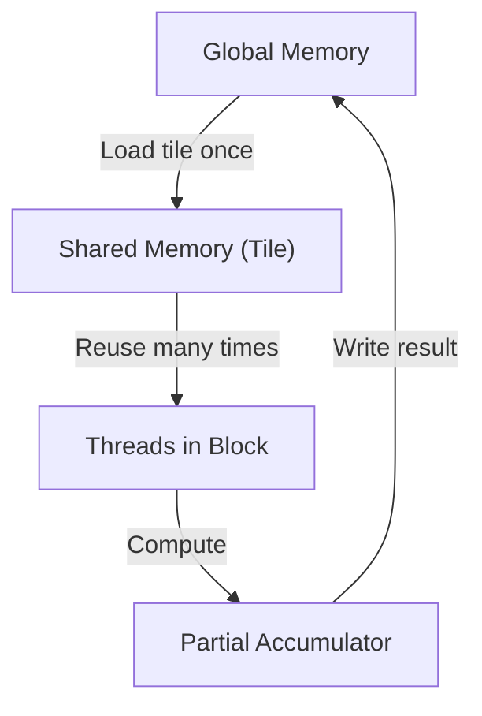
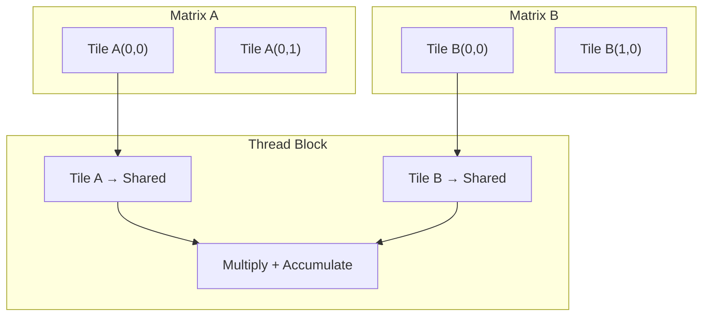

# What “tiling” means in NVIDIA CUDA
#### Author: Gene Boo, Oct 2025



**Tiling** is a performance technique where:

-   Data is divided into **tiles**
-   Each tile is processed by one **thread block**
-   The tile is loaded into **shared memory**
-   Threads cooperate to reuse data efficiently

This is fundamental to:

-   Matrix multiplication
-   CNNs
-   Image processing
-   Tensor Core workloads

On NVIDIA GPUs:

-   **Tile ≈ block‑local shared memory region**
-   Typically mapped to `blockIdx`, `threadIdx` in CUDA
----------
Below is a **clean, from‑first‑principles mathematical explanation** of **tiling for matrix multiplication**, independent of CUDA or programming language. This is suitable for **MD docs, design notes, or performance papers**.


----------

# Mathematics of Tiling for Matrix Multiplication

## Baseline Matrix Multiplication

Let

-   $A \in \mathbb{R}^{N \times K}$
-   $B \in \mathbb{R}^{K \times M}$
-   $C = AB \in \mathbb{R}^{N \times M}$

Matrix multiplication is defined element‑wise as

$$
C_{i,j} = \sum_{k=0}^{K-1} A_{i,k} \cdot B_{k,j}
$$

This formulation is mathematically correct but does not exploit data reuse.

----------

## Why Tiling Is Useful (Mathematical Motivation)

Observe that

-   Each element $A_{i,k}$ contributes to all columns $j$
-   Each element $B_{k,j}$ contributes to all rows $i$

Therefore, many operands are reused across the summation.  
Tiling reorganizes the summation to make this reuse explicit.

----------

## Step 1: Partition the Summation Index

Choose a tile size $T$.

Rewrite the reduction index $k$ as

k=tT+rk = tT + r

where

-   $t = 0, 1, \dots, \frac{K}{T} - 1$
-   $r = 0, 1, \dots, T - 1$

Substituting into the original definition yields


$$
C_{i,j}= \sum_{t=0}^{K/T-1} \sum_{r=0}^{T-1}A_{i,tT+r} \cdot B_{tT+r,j}
$$
  

This expression is algebraically identical to the naive formulation of matrix

multiplication. The difference lies only in how the computation is grouped.

----------

## Step 2: Partition the Output Space

Partition the output indices as

i=IT+i′i = IT + i'

j=JT+j′j = JT + j'

where

-   $(I,J)$ identifies the output tile
-   $(i',j')$ identifies an element within the tile

Each output tile satisfies

C(I,J)∈RT×TC^{(I,J)} \in \mathbb{R}^{T \times T}

----------


## Step 3: Define Tiled Submatrices

  

To express tiling mathematically, we define **submatrices** (tiles) of the

original matrices $A$ and $B$.

  

These submatrices correspond exactly to the blocks processed together.

  

The tile of matrix $A$ is defined as:

  

$$
A^{(I,t)} =A_{IT:(I+1)T,\; tT:(t+1)T}
$$

  

The tile of matrix $B$ is defined as:

  

$$
B^{(t,J)} =B_{tT:(t+1)T,\; JT:(J+1)T}
$$

  

Each submatrix is a contiguous block of size $T \times T$.

  

Using these definitions, each output tile is computed as:

  

$$
C^{(I,J)} =\sum_{t=0}^{K/T-1}
A^{(I,t)} \cdot B^{(t,J)}
$$

  

This equation is the **fundamental mathematical statement of tiling**.

----------

## Step 4: Element‑wise Expression Inside a Tile

For an element within an output tile,

$$
C_{IT+i',\;JT+j'}=
\sum_{t=0}^{K/T-1}
\sum_{r=0}^{T-1}
A_{IT+i',\;tT+r}
\cdot
B_{tT+r,\;JT+j'}
$$

This shows that

-   Each tile of $A$ is reused across all $j'$
-   Each tile of $B$ is reused across all $i'$

----------

## Memory Reuse Property

Without tiling,

-   Each $A_{i,k}$ is used once per column $j$
-   Each $B_{k,j}$ is used once per row $i$

With tiling,

-   Each tile of $A$ is reused $T$ times
-   Each tile of $B$ is reused $T$ times

The reuse factor is therefore approximately

$$\text{Reuse} \approx T$$

----------


## Arithmetic Intensity Analysis

  

Floating‑point operations per tile:

  

$$
\text{FLOPs} = 2T^3
$$

  

Global memory loads per tile:

  

$$
\text{Memory Loads} \approx 2T^2
$$

  

Arithmetic intensity becomes:

  

$$
\frac{2T^3}{2T^2} = T
$$

  

This explains why performance improves with larger tiles until resource limits

(such as shared memory or register capacity) are reached.

----------

## Tensor Core (Warp‑Level) Tiling

NVIDIA Tensor Cores evaluate fixed‑size tile products:

C16×16=A16×16⋅B16×16C^{16 \times 16} = A^{16 \times 16} \cdot B^{16 \times 16}

Element‑wise, this corresponds to

$$
C_{i,j} = \sum_{k=0}^{15} A_{i,k} \cdot B_{k,j}
$$

This is exactly the tiled formulation with $T = 16$, implemented directly in hardware.

----------

## One‑Paragraph Summary

> Tiling rewrites matrix multiplication by partitioning both the summation index and the output indices into fixed‑size blocks. Each output tile $C^{(I,J)}$ is computed as a sum of products of submatrices $A^{(I,t)}$ and $B^{(t,J)}$. This transformation preserves mathematical correctness while increasing operand reuse, improving arithmetic intensity and enabling efficient execution on modern GPU architectures.

----------


# CUDA Matrix Multiplication Tiling — A Practical, Intuitive Guide

This document explains **matrix multiplication tiling** in a way that is:

- Mathematically correct
- Easy to understand for non‑experts
- Ready to render in **StackEdit** (Markdown + LaTeX)

You can read it top‑to‑bottom like an instruction manual.

---

## 1. What Problem Are We Solving?

Matrix multiplication combines two matrices to produce a third one. It is used everywhere:

- Machine learning (neural networks)
- Image and signal processing
- Scientific simulation

The challenge is **performance**. Modern GPUs are extremely fast at computation, but **slow compared to computation when accessing memory**. Tiling exists to reduce this memory cost.

---

## 2. The Basic Mathematical Definition

Let

- $A \in \mathbb{R}^{N 	imes K}$
- $B \in \mathbb{R}^{K 	imes M}$
- $C = AB \in \mathbb{R}^{N 	imes M}$

Each element of $C$ is computed as

$$
C_{i,j} = \sum_{k=0}^{K-1} A_{i,k} \cdot B_{k,j}
$$

**Plain‑English meaning:**
- Pick row $i$ from $A$
- Pick column $j$ from $B$
- Multiply corresponding elements and add them up

This formula is correct — but inefficient for large matrices on real hardware.

---

## 3. Why the Naive Approach Is Slow

In the formula above:

- The same value $A_{i,k}$ is reused many times for different columns $j$
- The same value $B_{k,j}$ is reused many times for different rows $i$

However, the naive approach reloads these values from memory repeatedly.

**Key insight:**
> The math already has reuse — but the computation order does not take advantage of it.

---

## 4. The Core Idea of Tiling (Intuition First)

Instead of working on the entire matrix at once, we:

1. Cut the matrices into small square blocks called **tiles**
2. Load one tile into fast memory
3. Fully use that tile before moving on

**Analogy:**
> Instead of walking to the fridge for every ingredient, bring several ingredients to the table and cook efficiently.

---

## 5. Introducing a Tile Size

Choose a tile size $T$ (for example, $T = 16$ or $32$).

We will process matrices in chunks of size $T \times T$.

---

## 6. Tiling the Summation Index

Rewrite the summation index $k$ as

$$
k = tT + r
$$

where
- $t = 0,1, \dots, \frac{K}{T} - 1$ 
- $r = 0, 1, \dots, T - 1$

Substituting this into the original equation gives

$$
C_{i,j}=
\sum_{t=0}^{K/T-1}
\sum_{r=0}^{T-1}
A_{i,tT+r} \cdot B_{tT+r,j}
$$

**Nothing has changed mathematically** — only the grouping.

---

## 7. Tiling the Output Matrix

We also split the output indices:

$$
i = IT + i'
$$

$$
j = JT + j'
$$

Here:

- $(I,J)$ identifies which **tile** of the output we are computing
- $(i',j')$ identifies the position **inside that tile**

Each output tile satisfies

$$
C^{(I,J)} \in \mathbb{R}^{T 	imes T}
$$

---

## 8. Defining Tiled Submatrices

We now define submatrices of $A$ and $B$:

$$
A^{(I,t)} = A_{IT:(I+1)T,\;tT:(t+1)T}
$$

$$
B^{(t,J)} = B_{tT:(t+1)T,\;JT:(J+1)T}
$$

These are exactly the tiles we load into fast memory.

---

## 9. Tile‑Level Matrix Multiplication

Using these definitions, each output tile is computed as

$$
C^{(I,J)}=
\sum_{t=0}^{K/T-1}
A^{(I,t)} \cdot B^{(t,J)}
$$

**Plain‑English meaning:**
> To compute one output tile, multiply pairs of input tiles and accumulate the results.

This is the central mathematical idea behind tiling.

---

## 10. Element‑Wise View Inside a Tile

For an individual element inside a tile:

$$
C_{IT+i',\;JT+j'}=
\sum_{t=0}^{K/T-1}
\sum_{r=0}^{T-1}
A_{IT+i',\;tT+r}
\cdot
B_{tT+r,\;JT+j'}
$$

This shows explicitly how values are reused many times **after being loaded once**.

---

## 11. Memory Reuse Explained Simply

Without tiling:
- Data is loaded from memory repeatedly

With tiling:
- Each tile of $A$ is reused $T$ times
- Each tile of $B$ is reused $T$ times

The reuse factor is approximately

$$
\text{Reuse} \approx T
$$

More reuse means fewer memory accesses and higher performance.

---

## 12. Arithmetic Intensity (Why GPUs Love Tiling)

For a single tile computation:


$$
\text{FLOPs} = 2T^3
$$

  

$$
\text{Memory Loads} \approx 2T^2
$$

  

Arithmetic intensity becomes

  

$$
\frac{2T^3}{2T^2} = T
$$

As $T$ grows, computation increases faster than memory traffic — ideal for GPUs.

---

## 13. Tensor Cores: Hardware‑Level Tiling

NVIDIA Tensor Cores operate on fixed tiles:

$$
C^{16 	imes 16} = A^{16 	imes 16} \cdot B^{16 	imes 16}
$$

Element‑wise:

$$
C_{i,j} = \sum_{k=0}^{15} A_{i,k} \cdot B_{k,j}
$$

This is exactly the tiled formulation with $T = 16$, implemented directly in hardware.

---

## 14. Final Takeaway

> Tiling reorganizes matrix multiplication to match how hardware really works. It keeps data close, maximizes reuse, and transforms a correct but inefficient formula into one that runs at peak performance on modern GPUs.

----------

# CUDA Tiling Examples in C++, Python, Rust, and VBA

This document shows how **CUDA tiling (shared‑memory block tiling)** is expressed and used across different languages.

The key rule to remember is:

CUDA tiling always happens inside CUDA kernels.  
Other languages only launch those kernels.

***

## 1. C++ (CUDA) — Canonical Tiled Matrix Multiplication

```cpp
#define TILE 16

extern "C" __global__
void matmul_tiled(float* A, float* B, float* C, int N)
{
    __shared__ float As[TILE][TILE];
    __shared__ float Bs[TILE][TILE];

    int row = blockIdx.y * TILE + threadIdx.y;
    int col = blockIdx.x * TILE + threadIdx.x;

    float sum = 0.0f;

    for (int t = 0; t < N / TILE; t++) {
        As[threadIdx.y][threadIdx.x] =
            A[row * N + t * TILE + threadIdx.x];

        Bs[threadIdx.y][threadIdx.x] =
            B[(t * TILE + threadIdx.y) * N + col];

        __syncthreads();

        for (int k = 0; k < TILE; k++) {
            sum += As[threadIdx.y][k] * Bs[k][threadIdx.x];
        }

        __syncthreads();
    }

    C[row * N + col] = sum;
}
```

This is the reference implementation.  
All other languages ultimately rely on kernels like this.

***

## 2. Python — CUDA Tiling

### 2.1 Numba CUDA (manual tiling)

```python
from numba import cuda, float32

TILE = 16

@cuda.jit
def matmul_tiled(A, B, C):
    As = cuda.shared.array((TILE, TILE), float32)
    Bs = cuda.shared.array((TILE, TILE), float32)

    tx = cuda.threadIdx.x
    ty = cuda.threadIdx.y

    row = cuda.blockIdx.y * TILE + ty
    col = cuda.blockIdx.x * TILE + tx

    tmp = 0.0

    for t in range(A.shape[0] // TILE):
        As[ty, tx] = A[row, t * TILE + tx]
        Bs[ty, tx] = B[t * TILE + ty, col]
        cuda.syncthreads()

        for k in range(TILE):
            tmp += As[ty, k] * Bs[k, tx]

        cuda.syncthreads()

    C[row, col] = tmp
```

This corresponds line‑for‑line with the CUDA C++ kernel.

***

### 2.2 CuPy (implicit tiling via cuBLAS)

```python
import cupy as cp

A = cp.random.rand(4096, 4096).astype(cp.float32)
B = cp.random.rand(4096, 4096).astype(cp.float32)

C = A @ B
```

Tiling is handled internally by cuBLAS and Tensor Core kernels.

***

## 3. Rust — CUDA Tiling via `cust`

Rust does not express tiling directly.  
The tiling lives in the CUDA kernel.

***

### 3.1 CUDA kernel (compiled to PTX)

```cpp
extern "C" __global__
void matmul_tiled(float* A, float* B, float* C, int N)
{
    // Same implementation as the C++ kernel above
}
```

Compile with:

```bash
nvcc -ptx matmul.cu -o matmul.ptx
```

***

### 3.2 Rust launcher

```rust
use cust::prelude::*;

fn launch_matmul(
    ptx: &str,
    d_a: DevicePointer<f32>,
    d_b: DevicePointer<f32>,
    d_c: DevicePointer<f32>,
    n: i32,
) -> CudaResult<()> {
    cust::init(CudaFlags::empty())?;

    let device = Device::get_device(0)?;
    let _ctx = Context::create_and_push(
        ContextFlags::MAP_HOST | ContextFlags::SCHED_AUTO,
        device,
    )?;

    let module = Module::from_ptx(ptx, &[])?;
    let func = module.get_function("matmul_tiled")?;

    let block = Dim3::new(16, 16, 1);
    let grid = Dim3::new(
        (n as u32 + 15) / 16,
        (n as u32 + 15) / 16,
        1,
    );

    let stream = Stream::new(StreamFlags::DEFAULT, None)?;

    unsafe {
        launch!(
            func<<<grid, block, 0, stream>>>(
                d_a,
                d_b,
                d_c,
                n
            )
        )?;
    }

    stream.synchronize()?;
    Ok(())
}
```

***

## 4. VBA — CUDA via DLL (realistic approach)

VBA cannot run CUDA kernels directly.  
The only workable approach is to call a CUDA DLL.

***

### 4.1 C++ CUDA DLL export

```cpp
extern "C" __declspec(dllexport)
void matmul_cuda(float* A, float* B, float* C, int N)
{
    // Internally launches CUDA kernel with tiling
}
```

***

### 4.2 VBA caller

```vb
Declare PtrSafe Sub matmul_cuda _
    Lib "cuda_matmul.dll" _
    (ByRef A As Single, _
     ByRef B As Single, _
     ByRef C As Single, _
     ByVal N As Long)

Sub RunCudaMatmul()
    Dim N As Long
    N = 1024
    Call matmul_cuda(A(0), B(0), C(0), N)
End Sub
```

***

## Summary

CUDA tiling always happens in CUDA kernels.

C++ expresses tiling directly.  
Python and Rust launch tiled CUDA kernels.  
VBA can only call into compiled CUDA code.


